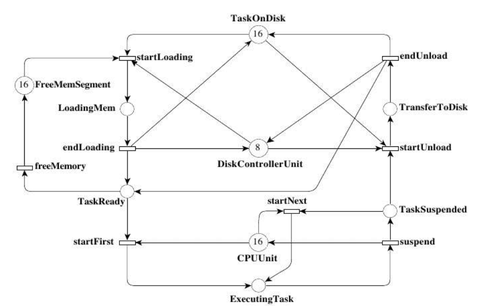
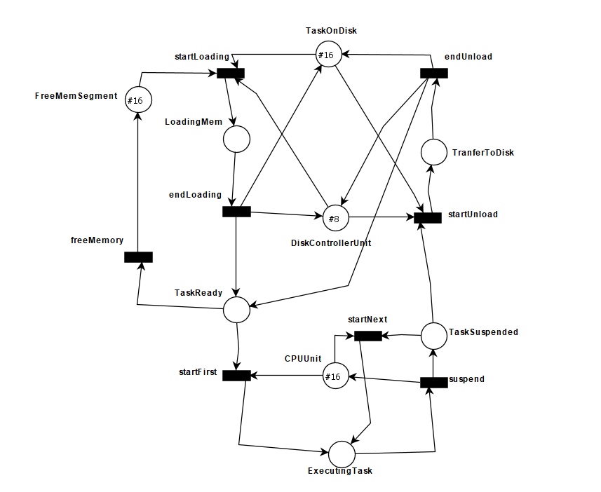
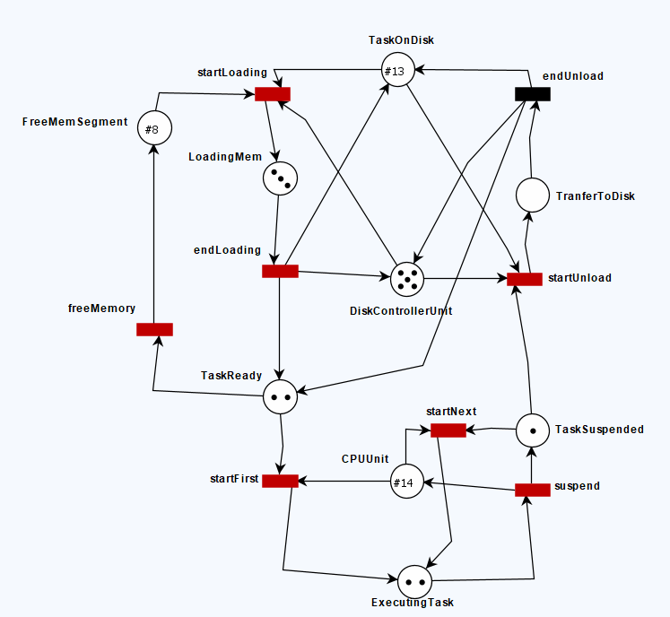
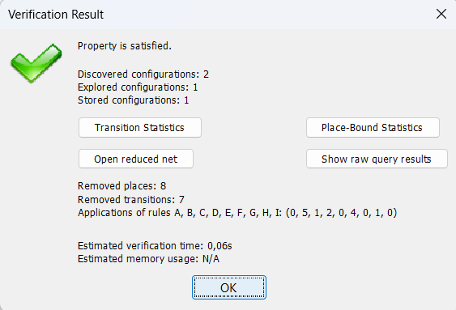

# Modelo de Rede de Petri - Sistema Operacional no TAPAAL

## TAPAAL

TAPAAL é um acrônimo para "Timed-Arc Petri Net Analysis and Verification Tool" (Ferramenta de Análise e Verificação de Redes de Petri com Arcos Temporizados, em tradução livre). Trata-se de uma ferramenta de software de código aberto que é usada para modelar, simular, verificar e analisar sistemas temporizados usando Redes de Petri Temporizadas (Timed Petri Nets). O software é usado principalmente em pesquisa e desenvolvimento de sistemas críticos em tempo real, onde a verificação formal e a modelagem de sistemas são essenciais para garantir o funcionamento correto e seguro. Ele é uma ferramenta útil para engenheiros, cientistas da computação e pesquisadores que trabalham em áreas que envolvem sistemas temporizados e sistemas embarcados. Além disso, como é uma ferramenta de código aberto, está disponível gratuitamente para a comunidade, facilitando seu uso e contribuições de desenvolvedores.

Editor Gráfico: O TAPAAL oferece uma interface gráfica para a criação de modelos de Redes de Petri Temporizadas, tornando-o acessível para engenheiros e modeladores.

- Simulação: É possível simular o comportamento do sistema modelado para verificar seu funcionamento antes de realizar análises formais.

- Verificação: O TAPAAL suporta a verificação formal de propriedades dos modelos, como propriedades de deadlock, alcançabilidade, vivacidade e outras.

- Geração de Contadores de Tempo: A ferramenta gera automaticamente contadores de tempo para ajudar na análise temporal dos modelos.

- Análise de Desempenho: Também permite a análise de desempenho, incluindo métricas como tempo de execução e latência.

## Rede de Petri

Uma Rede de Petri é um modelo matemático e gráfico utilizado para representar sistemas dinâmicos, especialmente sistemas concorrentes e paralelos. Ela foi desenvolvida por Carl Adam Petri na década de 1960 e é amplamente utilizada em engenharia de sistemas, ciência da computação e áreas relacionadas. Uma Rede de Petri consiste em dois elementos principais:
- Lugares (Places): São representados por círculos e representam estados ou condições do sistema. Eles podem conter uma certa quantidade de "marcas" que indicam recursos, tokens ou informações.

- Transições (Transitions): São representadas por retângulos e representam eventos ou ações que podem ocorrer no sistema. Para que uma transição ocorra, certas condições prévias nos lugares devem ser satisfeitas.

Além desses elementos básicos, uma Rede de Petri também inclui arcos direcionados que conectam lugares a transições (arcos de entrada) e transições a lugares (arcos de saída). Esses arcos indicam as condições que devem ser cumpridas para que uma transição possa ocorrer e as consequências de uma transição.

As Redes de Petri são úteis para modelar e analisar sistemas complexos, ajudando a visualizar interações entre componentes, identificar impasses, analisar concorrência e paralelismo, e verificar propriedades de sistemas, como a vivacidade e a alcançabilidade. Elas são aplicadas em uma variedade de campos, incluindo engenharia de software, automação industrial, telecomunicações e muitos outros, para ajudar na concepção e otimização de sistemas complexos.

## Verificação Formal

### Propriedade de Safety
A propriedade de segurança em sistemas refere-se à garantia de que determinadas condições indesejáveis não ocorrerão. Em outras palavras, um sistema é seguro se ele não permite que eventos prejudiciais ou comportamentos indesejados ocorram.

### Propriedade de Liveness
A propriedade de vivacidade em sistemas refere-se à garantia de que algum evento desejado eventualmente ocorrerá. Em outras palavras, um sistema é vivo se ele continua a fazer progresso ou a responder, mesmo que não seja necessariamente de forma imediata.

Em sistemas distribuídos, essas propriedades são cruciais para garantir que o sistema funcione de maneira confiável e eficaz, especialmente em ambientes críticos, como sistemas de controle industrial, sistemas financeiros e sistemas de saúde.


## Objetivo

Este trabalho tem por objetivo modelar uma rede de Petri que representa um sistema operacional simples utlizando-se da ferramenta TAPAAL, que consistem em um ambiente para modelagem, simulação e verificação de sistemas baseados em tempo real. O sistema operacional é modelado com base em tarefas (tasks), recursos e a alocação destes recursos.

## Representação da rede de Petri do problema

1. Uma task é carregada do disco para memória (requer um segmento de memória e memory segment);
2. Quando a tarefa está pronta para ser executada, pode obter um core, ser suspensa e obter um core novamente;
3. Quando a execução acaba, a task é salva novamente no disco.

<p align="center">

</p>

O sistema possui alguns parâmetros: M (Memory Segment), T (tasks), D (Disk Controllers) e C (Core). Para simplificar reduziu-se para dois únicos parametros MT e DC, em que: $$ M = T = MT $$ $$ D = DC $$ $$ C = 2 DC $$


## Modelagem do Sistema no TAPAAL

### Modelo

<p align="center">

</p>

### Simulação


## Verificação Formal

Os tipos de verificação possíveis no TAPAAL são:

- ``` (EF) Existe alguma marcação acessível que satisfaz ``` 
- ``` (EG) Existe um traço no qual cada marcação satisfaz ``` 
- ``` (AF) Em todos os traços existe eventualmente uma marcação que satisfaz ``` 
- ``` (AG) Todas as marcações acessíveis satisfazem ``` 

### Propriedade de Safety

- ``` AG !(deadlock) ``` 

### Propriedade de Liveness

- ``` E[] forall(i:id_task_t) task_sys(i).TaskSuspended imply task_sys(i).TaskUnloading``` 

- ``` E[] forall(i:id_task_t) task_sys(i).TaskLoadingMem imply task_sys(i).TaskReady```

- ```E[] forall(i:id_task_t) task_sys(i).TaskReady imply task_sys(i).TaskRunning```


## Resultados

### Deadlock:
<p align="center">

</p>

## Conclusão

Ao comparar a usabilidade do software em relação ao software UPAAL notou-se que a verificação é realizada de maneira mais eficaz e rapidamente
