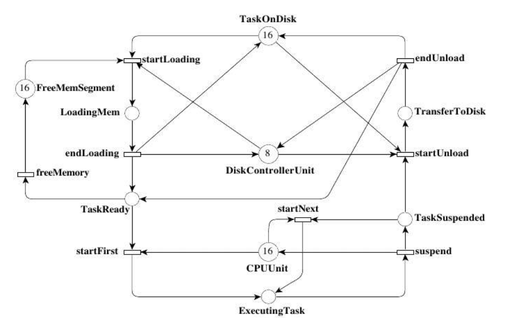
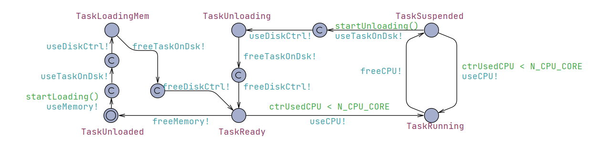
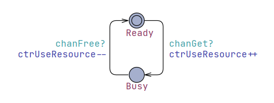
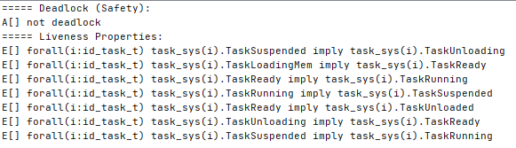
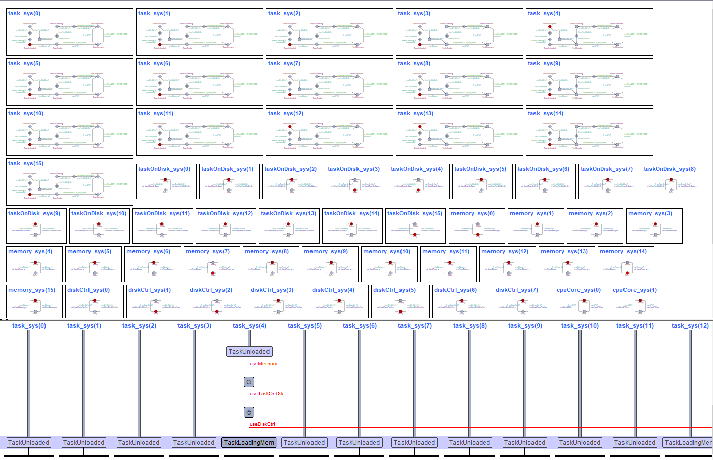
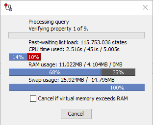
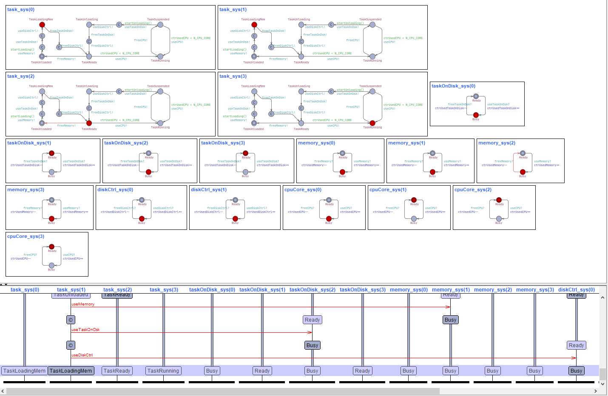
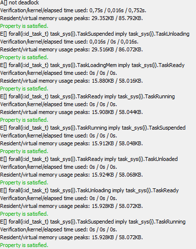

# Modelo de Rede de Petri - Sistema Operacional no UPPAAL

## UPPAAL

O UPPAAL é uma ferramenta de código aberto amplamente utilizada para modelagem, simulação e verificação de sistemas baseados em tempo real. Foi desenvolvido principalmente por pesquisadores da Universidade de Uppsala, na Suécia, e da Universidade de Aalborg, na Dinamarca. O nome "UPPAAL" é uma combinação das palavras "Uppsala" e "Aalborg."

Dentre as principais utilizações da ferramenta, destacam-se:

- Modelagem de Sistemas: UPPAAL permite a criação de modelos para sistemas reativos e sistemas baseados em tempo real. Esses modelos podem ser usados para representar sistemas como protocolos de comunicação, sistemas embarcados, sistemas de controle e muito mais.
- Linguagem de Modelagem: UPPAAL utiliza uma linguagem de modelagem formal, que é uma extensão da linguagem de descrição de sistemas temporizados (TDSL). Isso permite a representação precisa de sistemas que dependem do tempo.
- Simulação: Os modelos criados no UPPAAL podem ser simulados para entender o comportamento do sistema em diferentes cenários. Isso ajuda os desenvolvedores a depurar e ajustar seus sistemas antes da implementação real.
- Verificação Formal: Uma das capacidades mais poderosas do UPPAAL é a verificação formal. Ele permite que os engenheiros verifiquem automaticamente propriedades críticas em seus modelos, como propriedades de segurança e continuidade (liveness). Isso é crucial para sistemas críticos, onde erros podem ter consequências graves.

## Rede de Petri

Uma Rede de Petri é um modelo matemático e gráfico utilizado para representar sistemas dinâmicos, especialmente sistemas concorrentes e paralelos. Ela foi desenvolvida por Carl Adam Petri na década de 1960 e é amplamente utilizada em engenharia de sistemas, ciência da computação e áreas relacionadas. Uma Rede de Petri consiste em dois elementos principais:

- Lugares (Places): São representados por círculos e representam estados ou condições do sistema. Eles podem conter uma certa quantidade de "marcas" que indicam recursos, tokens ou informações.
- Transições (Transitions): São representadas por retângulos e representam eventos ou ações que podem ocorrer no sistema. Para que uma transição ocorra, certas condições prévias nos lugares devem ser satisfeitas.

Além desses elementos básicos, uma Rede de Petri também inclui arcos direcionados que conectam lugares a transições (arcos de entrada) e transições a lugares (arcos de saída). Esses arcos indicam as condições que devem ser cumpridas para que uma transição possa ocorrer e as consequências de uma transição.

As Redes de Petri são úteis para modelar e analisar sistemas complexos, ajudando a visualizar interações entre componentes, identificar impasses, analisar concorrência e paralelismo, e verificar propriedades de sistemas, como a vivacidade e a alcançabilidade. Elas são aplicadas em uma variedade de campos, incluindo engenharia de software, automação industrial, telecomunicações e muitos outros, para ajudar na concepção e otimização de sistemas complexos.

## Verificação Formal

### Propriedade de Safety

A propriedade de segurança em sistemas refere-se à garantia de que determinadas condições indesejáveis não ocorrerão. Em outras palavras, um sistema é seguro se ele não permite que eventos prejudiciais ou comportamentos indesejados ocorram.

### Propriedade de Liveness

A propriedade de vivacidade em sistemas refere-se à garantia de que algum evento desejado eventualmente ocorrerá. Em outras palavras, um sistema é vivo se ele continua a fazer progresso ou a responder, mesmo que não seja necessariamente de forma imediata.

Em sistemas distribuídos, essas propriedades são cruciais para garantir que o sistema funcione de maneira confiável e eficaz, especialmente em ambientes críticos, como sistemas de controle industrial, sistemas financeiros e sistemas de saúde.

### Linguagem CTL

A lógica da árvore de computação CTL combina operadores de tempo de ramificação e de tempo linear.
Nesta lógica, um quantificador de caminho pode prefixar uma asserção composta por combinações arbitrárias dos operadores usuais de tempo linear.

1. Quantificadores de caminho:

   - A — “para todos os caminhos”
   - E — “existe um caminho"
2. Operadores de tempo linear:

   - X p — p será verdadeiro na próxima vez.
   - F p — p é válido em algum momento no futuro
   - G p — p é válido globalmente no futuro
   - p U q — p é verdadeiro até que q seja verdadeiro

## Objetivo

Este trabalho tem por objetivo modelar uma rede de Petri que representa um sistema operacional simples utlizando-se da ferramenta UPPAAL, que consistem em um ambiente para modelagem, simulação e verificação de sistemas baseados em tempo real. O sistema operacional é modelado com base em tarefas (tasks), recursos e a alocação destes recursos.

## Representação da rede de Petri do problema

1. Uma task é carregada do disco para memória (requer um segmento de memória e memory segment);
2. Quando a tarefa está pronta para ser executada, pode obter um core, ser suspensa e obter um core novamente;
3. Quando a execução acaba, a task é salva novamente no disco.

<p align="center">

</p>

O sistema possui alguns parâmetros: M (Memory Segment), T (tasks), D (Disk Controllers) e C (Core). Para simplificar reduziu-se para dois únicos parametros MT e DC, em que: 

$$
M = T = MT
$$

$$
D = DC
$$

$$
C = 2 DC
$$


## Modelagem do Sistema no UPPAAL

### Task

```
templateTask()
```

<p align="center">

</p>

#### Funções:

```
bool startLoading()
{
    // Its necessary a FreeTaskOnDisk + FreeMemorySegment + FreeDiskController to Load a Task
    if(ctrUsedTaskOnDisk < N_TASK_ON_DISK && ctrUsedMemory < N_MEMORY && ctrUsedDiskCtrl < N_DISK_CTRL)
        return true;
    else
        return false;
}
```

```
bool startUnloading()
{
    if(ctrUsedTaskOnDisk < N_TASK_ON_DISK && ctrUsedDiskCtrl < N_DISK_CTRL)
        return true;
    else
        return false;
}
```

### Resource

```
templateResource(int &ctrUseResource, chan &chanGet, chan &chanFree)
```

<p align="center">

</p>

## Verificação Formal

<p align="center">

</p>

### Propriedade de Safety

- ``A[] not deadlock``

### Propriedade de Liveness

- `` E[] forall(i:id_task_t) task_sys(i).TaskSuspended imply task_sys(i).TaskUnloading``
- `` E[] forall(i:id_task_t) task_sys(i).TaskLoadingMem imply task_sys(i).TaskReady``
- ``E[] forall(i:id_task_t) task_sys(i).TaskReady imply task_sys(i).TaskRunning``
- ``E[] forall(i:id_task_t) task_sys(i).TaskRunning imply task_sys(i).TaskSuspended``
- ``E[] forall(i:id_task_t) task_sys(i).TaskReady imply task_sys(i).TaskUnloaded``
- ``E[] forall(i:id_task_t) task_sys(i).TaskUnloading imply task_sys(i).TaskReady``
- ``E[] forall(i:id_task_t) task_sys(i).TaskSuspended imply task_sys(i).TaskRunning``

## Resultados

### MT = 16 e DC = 8:

<p align="center">

</p>

O modelo demonstrou-se funcional, no entanto ressalta-se o alto custo computacional da ferramenta para a verificação formal do sistema. Ao aumentar o número de elementos no sistema o tempo e consumo de memória elevam exponencialmente. A seguir ilustra-se o tempo decorrido e memória utilizados durante o processo de verificação da primeira propriedade para

<p align="center">

</p>

### MT = 4 e DC = 2:

<p align="center">

</p>

Diminuindo o modelo para MT = 4 e DC = 2 foi possível recursos suficientes para verificação do sistema:

<p align="center">

</p>

## Conclusão

O software utilizado demonstrou uma demora acentuada para verificação de modelos com muitos elementos, dessa maneira realizou-se a verificação com a utilização de outro software específico para verificação de redes de petri cujo nome é TAPAAL. Os resultados obtidos podem ser acessados no repositório do autor.
