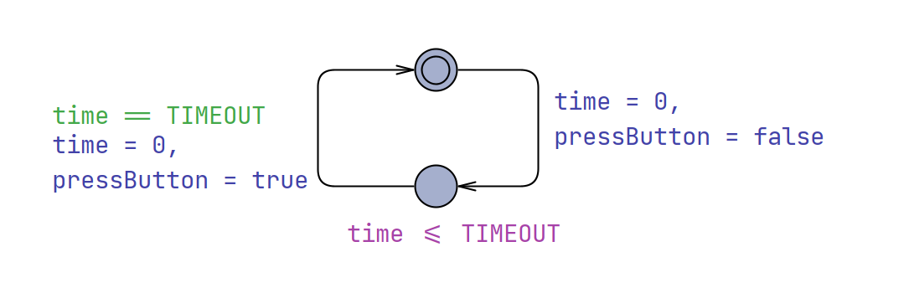
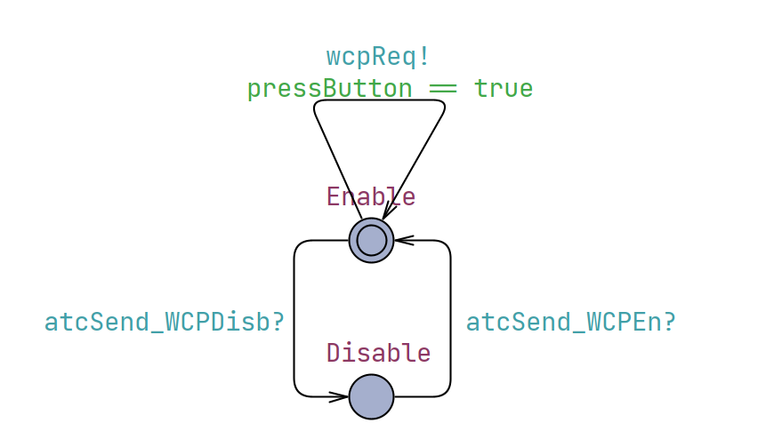
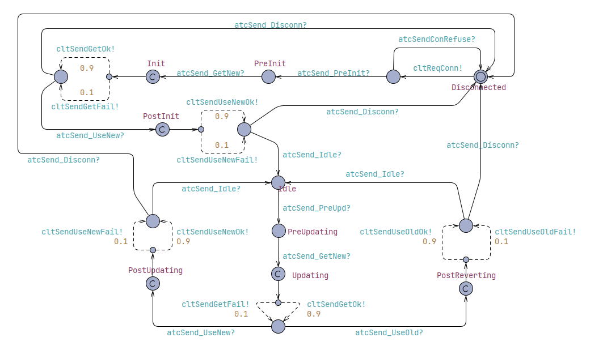
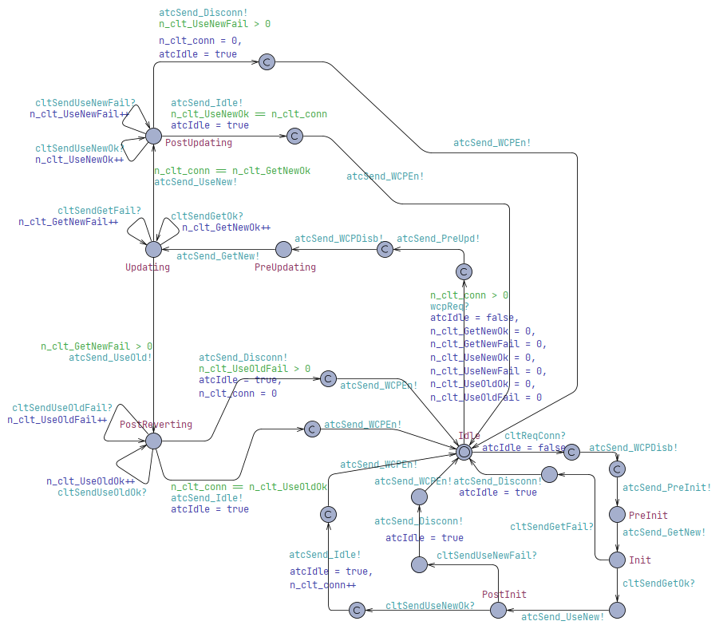
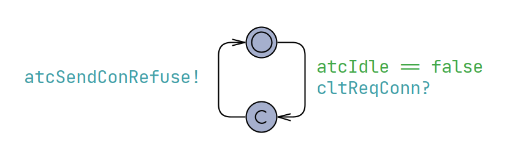
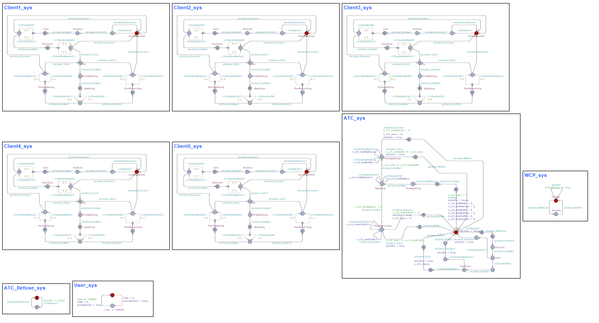
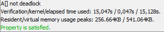

# Modeloagem de sistema de WeatherControl no UPPAAL

## UPPAAL

O UPPAAL é uma ferramenta de código aberto amplamente utilizada para modelagem, simulação e verificação de sistemas baseados em tempo real. Foi desenvolvido principalmente por pesquisadores da Universidade de Uppsala, na Suécia, e da Universidade de Aalborg, na Dinamarca. O nome "UPPAAL" é uma combinação das palavras "Uppsala" e "Aalborg."

Dentre as principais utilizações da ferramenta, destacam-se:

- Modelagem de Sistemas: UPPAAL permite a criação de modelos para sistemas reativos e sistemas baseados em tempo real. Esses modelos podem ser usados para representar sistemas como protocolos de comunicação, sistemas embarcados, sistemas de controle e muito mais.
- Linguagem de Modelagem: UPPAAL utiliza uma linguagem de modelagem formal, que é uma extensão da linguagem de descrição de sistemas temporizados (TDSL). Isso permite a representação precisa de sistemas que dependem do tempo.
- Simulação: Os modelos criados no UPPAAL podem ser simulados para entender o comportamento do sistema em diferentes cenários. Isso ajuda os desenvolvedores a depurar e ajustar seus sistemas antes da implementação real.
- Verificação Formal: Uma das capacidades mais poderosas do UPPAAL é a verificação formal. Ele permite que os engenheiros verifiquem automaticamente propriedades críticas em seus modelos, como propriedades de segurança e continuidade (liveness). Isso é crucial para sistemas críticos, onde erros podem ter consequências graves.

## Descrição do sistema

Verificar a descrição completa dos requisitos do sistema implementados no documento "requirements.pdf".

## Modelagem do Sistema no UPPAAL

### Usuário

Periodicamente o usuário muda a variável pressButton que representa o pressionamento de um botão

### WCP (Weather Control Panel)

Ao perceber o pressionamento do botão realizado pelo usuário o WCP realiza uma requisição para o ATC. Além disso, quando recece uma requisição de desabilitar do ATC o WCP muda de estado.

### Cliente

### ATC (AirTrafic Control)

### ATC Refuse
Este template foi implementado para simular um comportamento em "paralelo" para o ATC. Dessa maneira, o ATC responde todos os clientes mesmo quando estiver no estado de Idle.

## Resultados

## Modelo para 5 Clientes
O modelo permite escolher a quantidade de clientes desejado, para este caso de estudo optou-se por 5 clientes:

## Deadlock
Realizou-se a verificação formal para ausência de deadlock no sistema:

