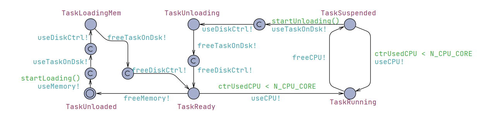
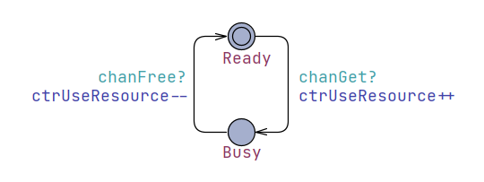

# Modelo de Rede de Petri - Sistema Operacional no UPPAAL

## Objetivo

Este trabalho tem por objetivo modelar uma rede de Petri que representa um sistema operacional simples utlizando-se da ferramenta UPPAAL, que consistem em um ambiente para modelagem, simulação e verificação de sistemas baseados em tempo real. O sistema operacional é modelado com base em tarefas (tasks), recursos e a alocação destes recursos.

## UPPAAL
O UPPAAL é uma ferramenta de código aberto amplamente utilizada para modelagem, simulação e verificação de sistemas baseados em tempo real. Foi desenvolvido principalmente por pesquisadores da Universidade de Uppsala, na Suécia, e da Universidade de Aalborg, na Dinamarca. O nome "UPPAAL" é uma combinação das palavras "Uppsala" e "Aalborg."
 
Dentre as principais utilizações da ferramenta, destacam-se:

- Modelagem de Sistemas: UPPAAL permite a criação de modelos para sistemas reativos e sistemas baseados em tempo real. Esses modelos podem ser usados para representar sistemas como protocolos de comunicação, sistemas embarcados, sistemas de controle e muito mais.

- Linguagem de Modelagem: UPPAAL utiliza uma linguagem de modelagem formal, que é uma extensão da linguagem de descrição de sistemas temporizados (TDSL). Isso permite a representação precisa de sistemas que dependem do tempo.

- Simulação: Os modelos criados no UPPAAL podem ser simulados para entender o comportamento do sistema em diferentes cenários. Isso ajuda os desenvolvedores a depurar e ajustar seus sistemas antes da implementação real.

- Verificação Formal: Uma das capacidades mais poderosas do UPPAAL é a verificação formal. Ele permite que os engenheiros verifiquem automaticamente propriedades críticas em seus modelos, como propriedades de segurança e continuidade (liveness). Isso é crucial para sistemas críticos, onde erros podem ter consequências graves.

## Representação da rede de Petri
<p align="center">

</p>

## Modelagem do Sistema no UPPAAL

### Task
<p align="center">

</p>

```
bool startLoading()
{
    // Its necessary a FreeTaskOnDisk + FreeMemorySegment + FreeDiskController to Load a Task
    if(ctrUsedTaskOnDisk < N_TASK_ON_DISK && ctrUsedMemory < N_MEMORY && ctrUsedDiskCtrl < N_DISK_CTRL)
        return true;
    else
        return false;
}
```

```
bool startUnloading()
{
    if(ctrUsedTaskOnDisk < N_TASK_ON_DISK && ctrUsedDiskCtrl < N_DISK_CTRL)
        return true;
    else
        return false;
}
```
### Resource
<p align="center">

</p>

## Verificação Formal

### Propriedade de Safety

### Propriedade de Liveness

## Conclusão

Este é um modelo simplificado de um sistema operacional usando redes de Petri no UPPAAL. Você pode estender esse modelo com mais detalhes e especificações, dependendo das características específicas do sistema operacional que deseja modelar.

